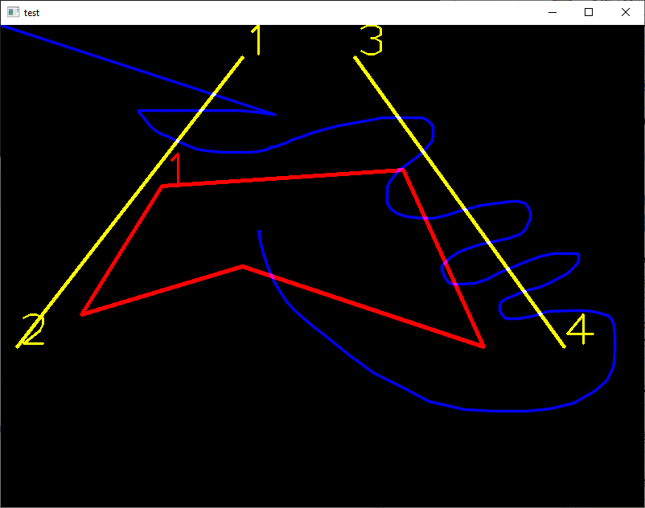

# Object Tracking with Line Crossing and Area Intrusion Detection
This program uses an object detection deep learning model and a re-identification model to find and track the objects in a movie. Then, the program will track the trajectory of the objects and check if the objects cross the defined virtual lines or the objects are inside the defined areas. The program uses [Intel(r) Distribution of OpenVINO(tm) toolkit](https://software.intel.com/en-us/openvino-toolkit) for deep learning inferencing.    
To track the objects, the program extracts the feature vectors from the objects which consists of 256 FP values with the re-identification DL model. The program can identify which object is most similar to the objects in the previous frame and record the trajectory. The L2 norm (or the distance) of those feature vectores represents the similarity of the objects. This program uses cosine distance to check the similarity between the objects.  
The line crossing check and area intrusion check are done by regular (meaning, non deep learning based) arithmetic algorithm.  
The latest version playbacks sound when an event such as crossing a line or entering to an area happens.  
You can learn how to use line-crossing and area intrusion function from simple test program (`test-line-cross-area-intrusion.py`)  

このプログラムはディープラーニングの物体検出モデルと特徴抽出(re-identification)モデルを用いて、ムービーフレーム中のオブジェクトを検出し、追跡するプログラムです。プログラムは見つけたオブジェクトの軌跡を記録し、オブジェクトが定義された仮想ラインを超えたり定義されたエリアに侵入したことを検出します。ディープラーニングの推論には[Intel(r) Distribution of OpenVINO(tm) toolkit](https://software.intel.com/en-us/openvino-toolkit)を利用しています。  
オブジェクトの追跡のために、プログラムは特徴抽出モデルを使用して見つけたオブジェクトから256個の浮動小数点数値からなる特徴ベクトルを抽出します。この特徴ベクトル同士のL2ノルム(=距離)がオブジェクト同士の類似度を表します。このプログラムではノルムの計算にコサイン距離を使用しています。  
ラインクロスとエリア侵入の判定には通常の(ディープラーニングベースではない)数学的アルゴリズムを使用しています。  
最新版はラインクロスしたりエリア侵入したりなどのイベント発生時にオーディオを再生します。  
コードを簡素化したテストプログラムも追加しました。ライン交差やエリア侵入判定関数の使い方などを学ぶことが可能です。(`test-line-cross-area-intrusion.py`)  

### Object Tracking and Line Crossing Demo


### Required DL Models to Run This Demo

The demo expects the following models in the Intermediate Representation (IR) format:

 * For person / pedestrian detection and re-identification
   * `pedestrian-detection-adas-0002`
   * `person-reidentification-retail-0031`

You can download these models from OpenVINO [Open Model Zoo](https://github.com/opencv/open_model_zoo).
In the `models.lst` is the list of appropriate models for this demo that can be obtained via `Model downloader`.
Please see more information about `Model downloader` [here](../../../tools/downloader/README.md).

## How to Run


### 0. Prerequisites
- **OpenVINO 2021.3**
  - If you haven't installed it, go to the OpenVINO web page and follow the [*Get Started*](https://software.intel.com/en-us/openvino-toolkit/documentation/get-started) guide to do it.  


### 1. Install dependencies  
The demo depends on:
- `opencv-python`
- `numpy`
- `scipy`
- `munkres`

To install all the required Python modules you can use:

``` sh
(Linux) pip3 install -r requirements.txt
(Win10) pip install -r requirements.txt
```

### 2. Download DL models from OMZ
Use `Model Downloader` to download the required models and convert the downloaded model into OpenVINO IR models with `Model Converter`.  
``` sh
(Linux) python3 $INTEL_OPENVINO_DIR/deployment_tools/tools/model_downloader/downloader.py --list models.lst
(Win10) python "%INTEL_OPENVINO_DIR%\deployment_tools\tools\model_downloader\downloader.py" --list models.lst
```

### 3. Run the demo app

``` sh
(Linux) python3 object-detection-and-line-cross.py
(Win10) python object-detection-and-line-cross.py
```

## Demo Output  
The application draws the results on the screen.


## Simple test program
`test-line-cross-area-intrusion.py` is a simple test program for line-crossing and area-intrusion detection. You can move mouse cursor to test how it works.  
  


## Coordinates checker
You can utilize `coordinates-checker` to get the coordinates of point of interest to define boundary lines and area polygons. The `coordinates-checker` is also included in this project as a submodule. See [coordinates-checker](https://github.com/yas-sim/coordinates-checker) GitHub repo for details.     
`python coordinates-checker\coordinates-checker.py [image.jpg / movie.mp4 / 0 ]`  

## Tested Environment  
- Windows 10 x64 1909 and Ubuntu 18.04 LTS  
- Intel(r) Distribution of OpenVINO(tm) toolkit 2021.3  
- Python 3.6.5 x64  

## See Also  
* [Using Open Model Zoo demos](../../README.md)  
* [Model Optimizer](https://docs.openvinotoolkit.org/latest/_docs_MO_DG_Deep_Learning_Model_Optimizer_DevGuide.html)  
* [Model Downloader](../../../tools/downloader/README.md)  
